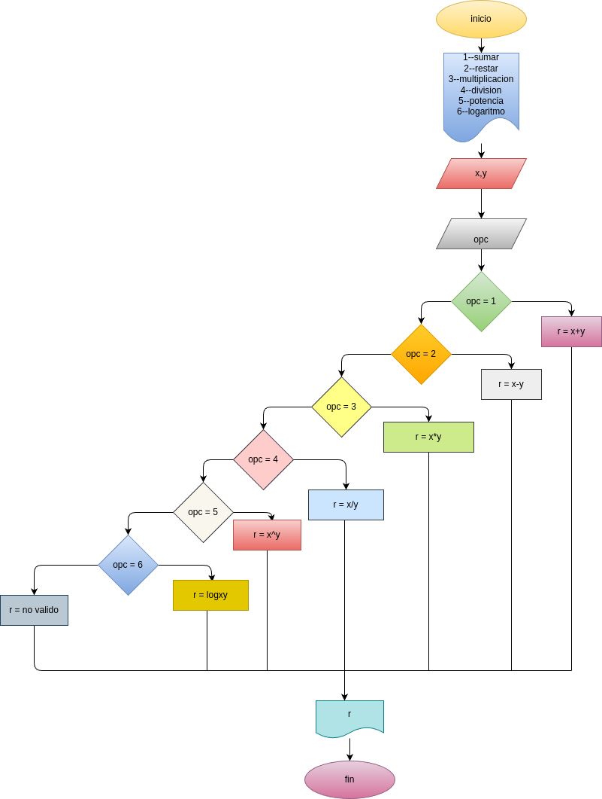

# Mini_Calcudora_Guanentino

# Analisis

## Input

### Variables de entrada
opc
 x(digite un numero)
 y(digite un numero)
### processing
opc = 1 x+y
opc = 2 x-y
opc = 3 x*y
opc = 4 x/y
opc = 5 x^y
opc = 6 xlogy
### output

# Diseño

# Construcion 